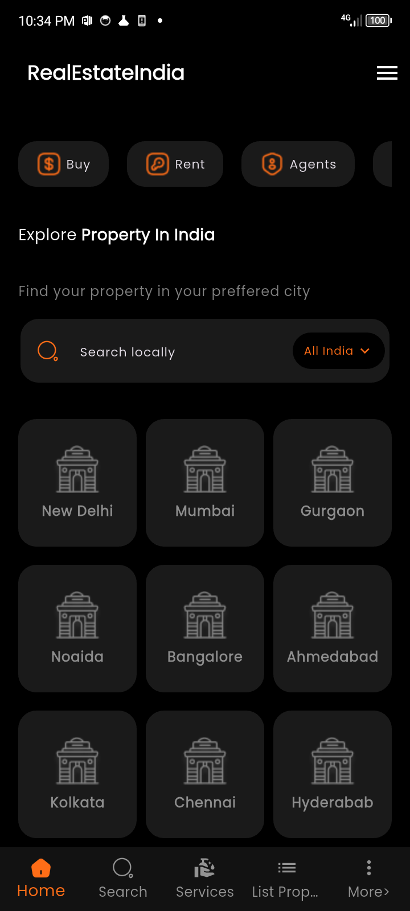
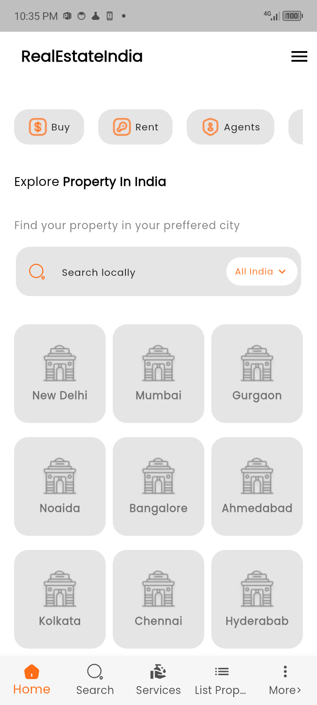
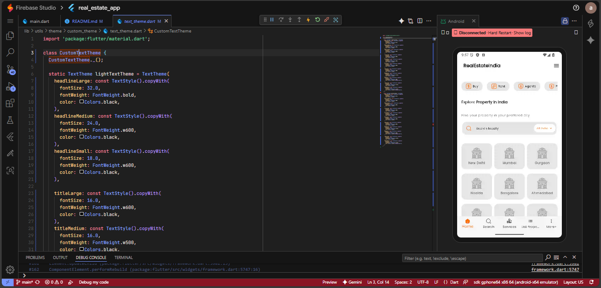
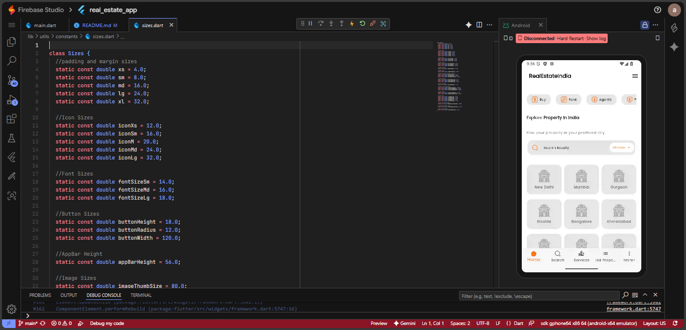

# Real Estate App

**Real Estate** is an app built with design inspiration from a community figma project. It shows how design can be converted to code with respect to content sizing, content padding, corner radii and text formatting:
  

The original app design was taken from [Real Estate](https://www.figma.com/community/file/1248882474410136052)  

---

## Download APK

If you want to try the Android app quickly, download the latest APK:

[](https://drive.google.com/drive/folders/14BFhQwjgL27DTzOp8_JLGSePZ0WM-MoF?usp=sharing)


---

## Screenshots

### Dark Screen
- A dark screen display of the home screen showing the quick navigation list, searchbar and a grid of options.



### Light Screen
- A light screen display of the home screen showing the quick navigation list, searchbar and a grid of options.



---

## Custom Widgets 
- The design was achieved by using predefined static variables to build widgets and also customized text theme for text formatting.

### Custom Text Theme



### Custom Static Variables




---


## Developer Guide — Clone & Run

### Prerequisites
- Flutter SDK (stable channel) and Android SDK
- A GitHub account (for cloning/pushing)
- Optional: `flutter_dotenv` for environment variables in Flutter

1. Clone the repository
```
   git clone https://github.com/ahmvddddd/real_estate_app.git
```
Navigate to the project directory:
```
cd real_estate_app
```

2. Install dependencies
Run the following command to fetch all the packages:
```
flutter pub get
```

3. Run the app
Make sure a device or emulator is running, then execute:
```
flutter run
```

4. Build APK (Android)
To build a release APK:
```
flutter build apk
```
Build for iOS (MacOS only)
To build the app for iOS:
```
flutter build ios
```

5. Troubleshooting
Run flutter doctor to check for setup issues:
```
flutter doctor

```
To clean the build:
```
flutter clean
flutter pub get
```